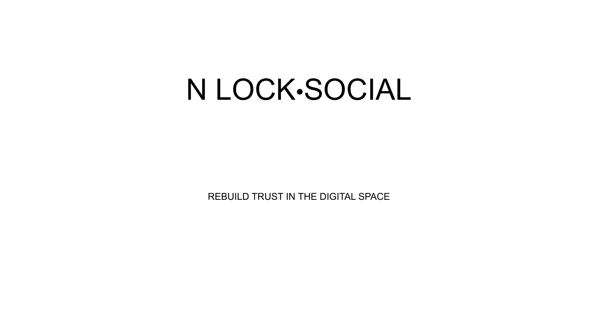

# NoLock Social Documentation

Welcome to the NoLock Social documentation directory. This documentation covers all aspects of the NoLock Social project and has been updated with the latest information from our presentation.

## Directory Structure

- [Overview](overview/README.md) - Introduction and general project information
- [Vision](vision/README.md) - Our core vision and principles
- [Problem](problem/README.md) - The problems we're addressing in the digital landscape
- [Solution](solution/README.md) - How NoLock Social works to address these issues
- [Connect](connect/README.md) - Ways to get involved and contact information
- [Assets](assets/README.md) - Images and other media assets

## About NoLock Social

NoLock Social is building a new digital ecosystem based on three core technologies:

1. **Universal Content-Addressable Storage (CAS)** - A decentralized, secure data layer
2. **Decentralized Identity with verifiable content** - User-controlled digital identities
3. **Networks of Trust** - Personal social networks built on real trust

Our approach fundamentally redefines how users create, share, and interact with content online, addressing the problems of centralization, content manipulation, and algorithmic filtering that plague current platforms.

## Key Technology Innovations

NoLock Social introduces several key innovations:

- **Unique Data Storage Algorithm** - Significantly reduces storage requirements for content-addressable systems
- **Content-Addressable Programming Language** - FunctionalScript enables efficient development for CAS-based applications
- **Trust-Based Social Networking** - A new paradigm that builds on weighted, subjective trust relationships

## Quick Start

To get a comprehensive understanding of NoLock Social, we recommend reading the documentation in this order:

1. [Overview](overview/README.md)
2. [Problem](problem/README.md)
3. [Vision](vision/README.md)
4. [Solution](solution/README.md)
5. [Connect](connect/README.md)

For a complete visual presentation, view our [full PDF presentation](assets/nolock_social_presentation.pdf).

## Contact Information

For questions about NoLock Social or this documentation:

- **Website**: [https://nolock.social/](https://nolock.social/)
- **Email**: [info@nolock.social](mailto:info@nolock.social)
- **Discord**: [https://discord.gg/QdatyarG94](https://discord.gg/QdatyarG94)
- **Bluesky**: [https://bsky.app/profile/nolock-social.bsky.social](https://bsky.app/profile/nolock-social.bsky.social)