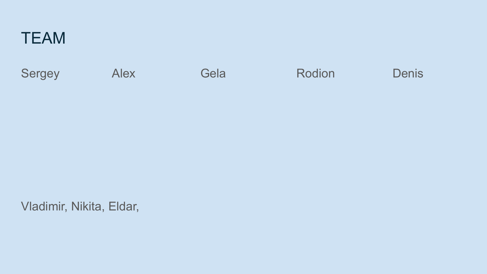

# Connect With Us

## Join Us in Rebuilding Digital Trust

We are seeking partners interested in building on this foundation. Join us in redefining digital trust, ownership, and connections in the digital space.

## Products and Projects

NoLock Social is developing several key products and technologies:

1. **Blockset** - Our core content-addressable storage technology
2. **Delfin** - A decentralized social network based on our trust model
3. **FunctionalScript** - A programming language designed for content-addressable data

## Ways to Get Involved

### For Developers

Contribute to building the technical foundation of NoLock Social:
- Backend development
- Frontend/UI implementation
- Security and privacy features
- Decentralized storage solutions
- FunctionalScript language development

### For Content Creators

Help us test and refine the platform by creating and sharing content:
- Early access to content creation tools
- Feedback on user experience
- Building initial trust networks
- Testing the decentralized content model

### For Organizations

Partner with us to explore how NoLock Social can serve your communities:
- Custom implementations
- Integration with existing platforms
- Community-specific features
- Collective AI ownership models

## Contact Information

- **Website**: [https://nolock.social/](https://nolock.social/)
- **Email**: [info@nolock.social](mailto:info@nolock.social)
- **Alternative Website**: [https://nolocksocial.com/](https://nolocksocial.com/)

## Social Media

- **Discord**: [https://discord.gg/QdatyarG94](https://discord.gg/QdatyarG94)
- **Bluesky**: [https://bsky.app/profile/nolock-social.bsky.social](https://bsky.app/profile/nolock-social.bsky.social)

## Stay Updated

Join our mailing list or Discord server to stay updated on project development, upcoming features, and opportunities to contribute.

## Team

### Core Team Members

- **Sergey** - Technology development
- **Alex** - Strategy and user experience
- **Gela** - Architecture and systems design
- **Rodion** - Network security and protocols
- **Denis** - Distributed systems and data integrity
- **Vladimir, Nikita, Eldar** - Software development

Our team brings together expertise in blockchain technology, social networking, security, UI/UX design, and community building to create a new paradigm for digital interaction.
