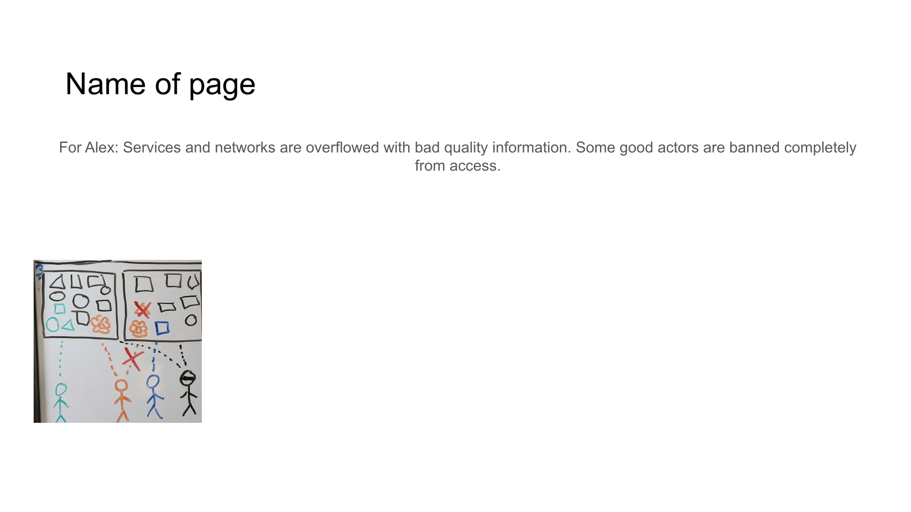

# The Problem

## Current Digital Landscape Issues

Today's social networks and digital services suffer from several fundamental problems that NoLock Social aims to address.

### Centralized Platform Control

Traditional platforms create fundamental issues of control and ownership:

- User data is locked into proprietary platforms (vendor lock-in)
- Risk of data loss when switching between services
- Limited ability to verify content authenticity
- Lack of interoperability between platforms

This centralized approach forces users to trust the platforms and accept their terms, often at the expense of privacy and control.

### Fragmentation and Duplication

Social networks and services start with a promise of connection but quickly become fragmented:

- Users maintain profiles across multiple platforms
- Content is duplicated across different services
- Different communities form in isolated environments
- User attention and data is scattered and divided

This fragmentation forces users to manage multiple digital identities and reduces the coherence of online discourse.

### Content Quality and Moderation Issues

The current approach to content moderation is fundamentally flawed:

- **Bad actors**: Spam, scams, and propaganda proliferate despite moderation
- **Inconsistent moderation**: Good actors sometimes find their legitimate content banned or restricted
- **Information overload**: Services become overflowed with low-quality information
- **Excessive control**: Some legitimate users are banned completely from accessing platforms

Centralized moderation creates both false positives (banning legitimate content) and false negatives (allowing harmful content).

### Lack of True Ownership

Users don't truly own their content or control who sees it - platforms do. This creates:

- Vulnerability to censorship
- Risk of data loss when platforms change policies
- Potential for content manipulation
- No guarantee of long-term access

Platform ownership of user data fundamentally undermines individual agency and control.

### Algorithmic Trust vs. Actual Trust

The fundamental problem with current platforms is how they manage trust:

- Algorithms determine what content you see based on engagement metrics
- "Trending" content is often the most controversial, not the most valuable
- Real human relationships and trust networks are replaced by algorithmic proxies
- Content is promoted based on its ability to generate reactions, not value

This algorithmic approach to trust creates filter bubbles, promotes divisive content, and undermines genuine human connection.

### Lack of Verifiability

In today's digital space:

- Content authenticity is difficult to verify
- Provenance of information is often unclear
- Timestamps and authorship can be manipulated
- Misinformation and disinformation diminish overall trust

These verification issues lead to a general erosion of trust in online information.
