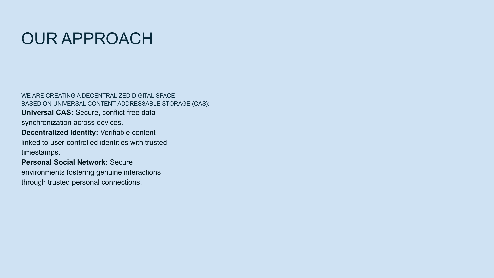

# Our Solution

## How NoLock Social Works

NoLock Social addresses the problems of current digital platforms through a fundamentally different approach to content, ownership, and connections.

### Three-Layer Architecture

Our solution is built on three core technological layers:

1. **Universal Content-Addressable Storage (CAS)**
   - A decentralized storage system where content is identified by cryptographic hash
   - Storage is unaware of content structure and relations between data blocks
   - Uses cryptographic hash functions to verify data integrity
   - Creates a secure foundation for all content

2. **Decentralized Identity with Immutable Source of Truth (DISOT)**
   - Built on top of CAS
   - Uses digital signatures and revision formats for handling mutable data
   - Provides verifiable content linked to user-controlled identities
   - Includes trusted timestamps for content verification

3. **Networks of Trust**
   - Built on DISOT
   - Focuses on weighted subjective trust to reduce information noise
   - Creates positive-sum interactions between users
   - Enables gradual reinforcement of trusted connections

### Immutable Content

All content created by users is immutable - it cannot be altered or deleted by third parties, including platform operators.

**Key Benefits:**
- What you create remains exactly as you intended
- No retroactive censorship or editing
- Creates a reliable foundation for digital discourse
- Establishes clear provenance and history for all content

### User Control

Users decide what to share publicly, what to share with specific connections, and what to keep private and encrypted.

**Control Mechanisms:**
- Granular privacy settings for each piece of content
- Ability to encrypt sensitive content
- Full control over who can access different types of content
- Direct ownership of all created content

This gives genuine control back to content creators, allowing them to manage their digital presence without platform interference.

### Trust-Based Networks

Unlike algorithmic feeds, NoLock Social emphasizes human connection and real trust:

- Gradually reinforcing connections with people you actually trust
- Building personal networks based on real relationships
- Ignoring or filtering out unwanted information
- Natural content discovery through trusted connections

### Key Advantages

Our approach offers several fundamental advantages:

- **Future-Proof**: Easy protocol and cryptography upgrades without data loss
- **Offline Functionality**: Works reliably without constant internet connectivity
- **Verifiable Content Links**: Ensures data authenticity and integrity
- **Personalized Trust**: User-defined trust ratings based on individual networks

### Technical Innovations

NoLock Social introduces two key technical innovations:

1. **Unique Data Storage Algorithm**
   - Significantly reduces storage space and network traffic
   - More efficient than traditional CAS systems
   - Enables practical use of content-addressable storage for everyday applications

2. **Content-Addressable Programming Language**
   - FunctionalScript: designed specifically for content-addressable data
   - Compatible with JavaScript
   - Highly scalable for distributed applications

### AI Integration

Our architecture provides an ideal foundation for AI and decentralized applications:

- **Digital Rights Framework**: Clearly defined content ownership and authenticity
- **Collective Ownership**: Enables decentralized management of AI resources
- **Verifiable Database**: Reliable, verifiable CAS database as a single source of truth
- **Enhanced Data Quality**: Improves data for machine learning through verified provenance

