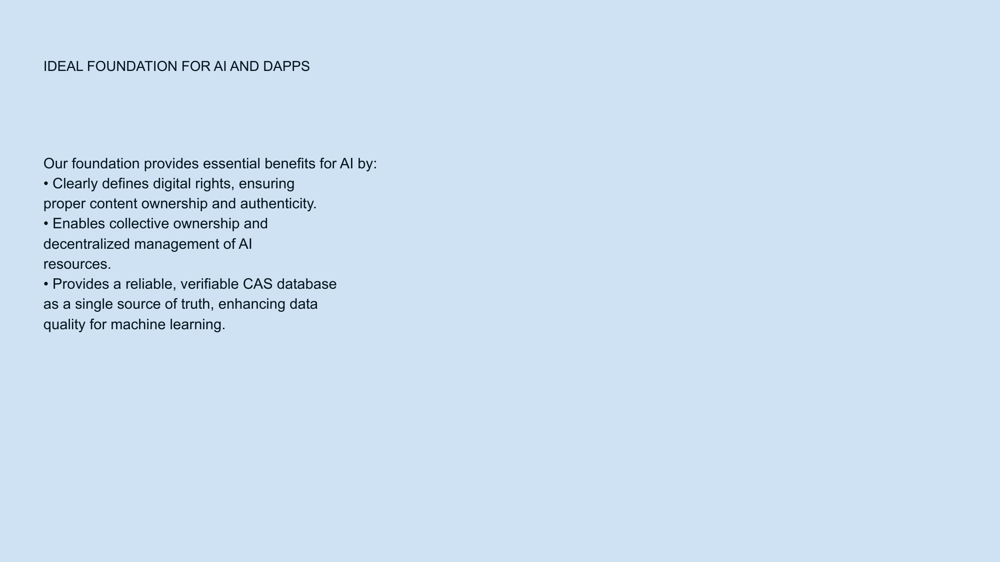

# Our Vision

## Rebuild Trust in the Digital Space

NoLock Social envisions a digital ecosystem where:

- Everyone creates their own immutable content
- Users can share, publish, or keep content encrypted and private
- Connections with trusted people are reinforced over time
- Low-quality information is filtered through trusted networks

## Core Principles

### 1. Content Ownership

Users own their content completely. In traditional social networks, the platform effectively owns your content - they can modify it, delete it, or change who can see it. With NoLock Social, your content remains yours in every sense.

### 2. Immutability

Content cannot be altered or deleted by third parties. Once published, your content remains as you created it, creating a foundation of reliability and consistency that is missing from current platforms.

### 3. Privacy Control

Users decide what to share and what to keep private. NoLock Social provides multiple levels of sharing:
- Public for anyone to see
- Shared with specific connections
- Fully encrypted and private

### 4. Trust Networks

Connections are built on actual trust, not algorithmic suggestions. Rather than having an algorithm decide what content is "engaging" or "relevant," NoLock Social allows users to naturally build networks based on real trust.

## Technology Foundation

Our vision is supported by three core technologies:

1. **Content-Addressable Storage (CAS)** - A storage system unaware of content structure where each piece of data is identified by its cryptographic hash
2. **Decentralized Immutable Source Of Truth (DISOT)** - Built on CAS, it uses digital signatures and revision formats to handle mutable data securely
3. **Networks Of Trust** - Built on DISOT, focuses on weighted subjective trust to reduce information noise and create positive-sum interactions

## AI Integration

We believe this architecture creates an ideal foundation for AI and decentralized applications by providing:

- A **Digital Rights Framework** with clearly defined content ownership and authenticity
- **Collective Ownership** enabling decentralized management of AI resources
- A **Verifiable Database** as a single source of truth
- **Enhanced Data Quality** for machine learning

## Long-term Vision

Over time, we envision a digital landscape where trust is rebuilt through genuine connection rather than algorithmic manipulation, where content remains authentic and unchangeable, and where users regain control over their digital identities and creations.

## Innovations

Our approach introduces several key innovations:

1. **Unique Data Storage Algorithm** - Significantly reduces storage space and network traffic compared to traditional CAS systems
2. **Content-Addressable Programming Language** - A specialized language (FunctionalScript) designed specifically for handling content-addressable data

