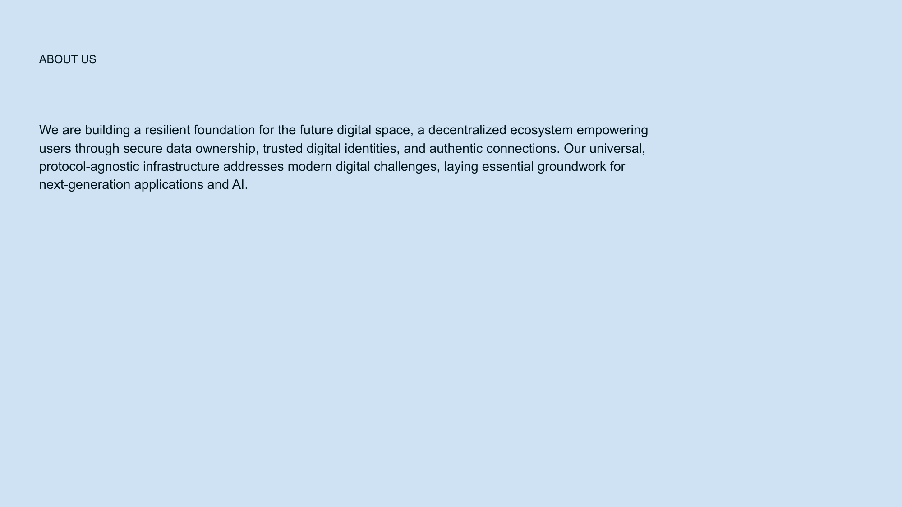

[← Previous](slide07.md) | [↑ Overview](../README.md) | [Next →](slide09.md)

---

# Business Model

## Dual Revenue Streams

*Dual revenue streams combining B2C freemium subscriptions and B2B technology licensing.*

## Two-Pronged Approach:

**1. Delfin Social Platform (B2C)**
- Freemium subscription model
- Free tier: Core identity & basic social features
- Premium tier: $7.99/month for advanced features
  - Enhanced privacy controls
  - Content discovery algorithms
  - Extended storage
- [Source: Social platform pricing benchmarks](https://www.statista.com/statistics/315614/social-network-site-fee-paying-users/)

**2. NoLock Technology Licensing (B2B)**
- Enterprise identity solutions: $10K-50K/month
- Decentralized storage infrastructure: $5K-30K/month
- Custom implementations: Project-based pricing
- [Source: Web3 B2B pricing models](https://outlierventures.io/research/state-of-web3-business-models/)

> *Projected gross margins: 75-85%* | [Industry benchmark source](https://medium.com/breadcrumb/saas-economics-gross-margin-part-1-919df3eb8e8e)

---

[← Previous](slide07.md) | [↑ Overview](../README.md) | [Next →](slide09.md)

