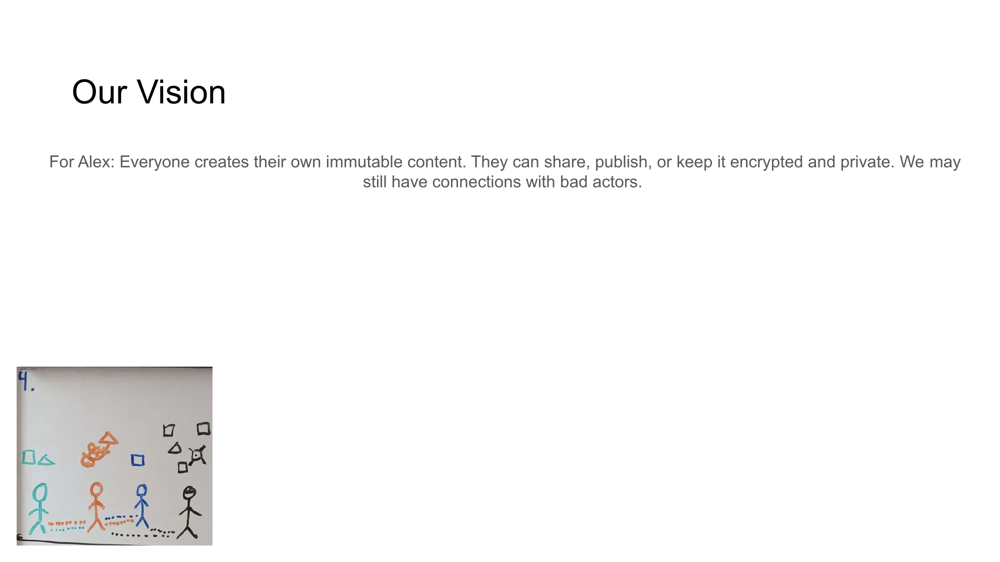

[← Previous](slide03.md) | [↑ Overview](../README.md) | [Next →](slide05.md)

---

# Market Opportunity

## Decentralized Social Networks & Digital Trust

*A rapidly growing $12B market projected to reach $101B by 2033 with clear TAM/SAM/SOM breakdown.*

## Market Analysis:

**Total Addressable Market (TAM):**
- $12.13 billion in 2023
- Projected to reach $101.2 billion by 2033
- 25% CAGR
- [Source: Market Research Future (MRFR)](https://www.marketresearchfuture.com/reports/decentralized-social-network-market-11591)

**Serviceable Addressable Market (SAM):**
- $4.8 billion (40% of TAM)
- Identity & content verification segments
- [Source: Grand View Research](https://www.grandviewresearch.com/industry-analysis/digital-identity-solutions-market)

**Serviceable Obtainable Market (SOM):**
- Year 1: $24 million (0.5% of SAM)
- Year 3: $240 million (5% of SAM)
- Based on [projected adoption rates](https://www.statista.com/statistics/1281525/web3-sector-predicted-market-size-worldwide/) for Web3 technologies

---

[← Previous](slide03.md) | [↑ Overview](../README.md) | [Next →](slide05.md)

