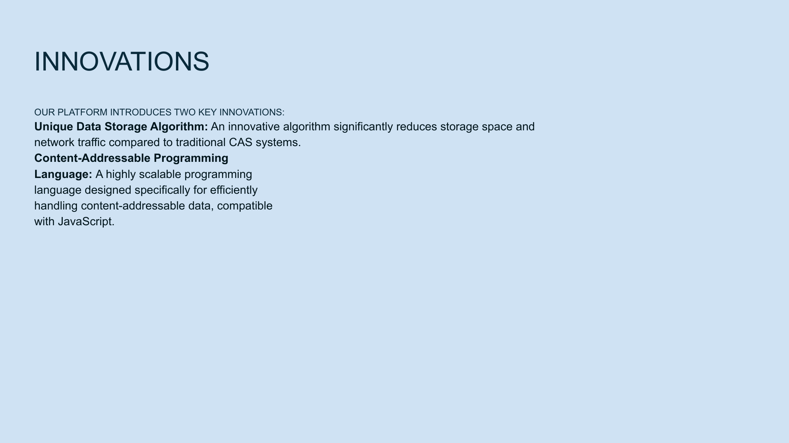

[← Previous](slide09.md) | [↑ Overview](../README.md) | [Next →](slide11.md)

---

# Traction & Milestones

## Progress & Roadmap

*Demonstrated progress with early partnerships, developer traction, and clear roadmap.*

## Progress To Date:

**✓ Technology Development**
- Core infrastructure built and tested
- Alpha version of Delfin application

**✓ Partnerships**
- Integration with personal finance company for identity verification
- Two developer teams building on our API

**✓ Community Building**
- 2,500+ developers in early access program
- 15,000+ waitlist signups

## Next 12 Months:
- Public beta launch (Q3 2023)
- Enterprise partner program (Q4 2023)
- Full production launch (Q2 2024)

---

[← Previous](slide09.md) | [↑ Overview](../README.md) | [Next →](slide11.md)

