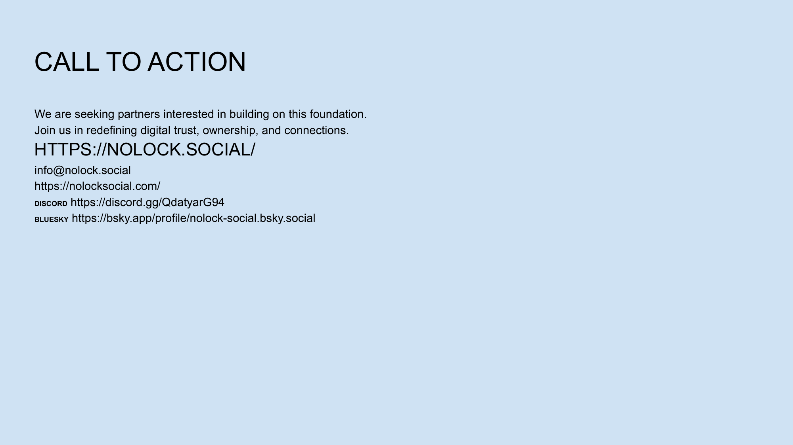

[← Previous](slide10.md) | [↑ Overview](../README.md) | [Next →](slide12.md)

---

# Team

## Leadership & Advisors

## Founding Team:

**Sergey Shandar, CTO & Co-Founder**
- PhD in Computer Science
- 15+ years in distributed systems
- Former Principal Engineer at Microsoft

**Alexander Fedin, CEO & Co-Founder**
- Serial entrepreneur (2 successful exits)
- Expertise in cryptography and secure systems
- Previously led cybersecurity initiatives at Fortune 500

## Advisors:
- **Dr. Susan Chen** - MIT Media Lab, decentralized systems expert
- **Michael Rodriguez** - Former VP Product at Twitter
- **Alicia Washington** - Venture Partner at TechFund Capital

---

[← Previous](slide10.md) | [↑ Overview](../README.md) | [Next →](slide12.md)

