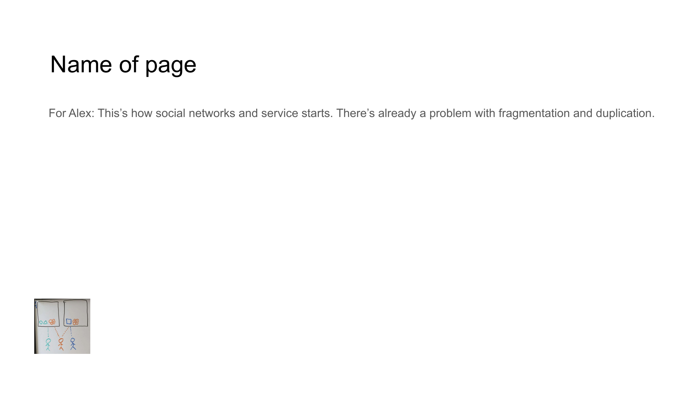

# DIGITAL LANDSCAPE CHALLENGES



## For Alex
This's how social networks and service starts. There's already a problem with fragmentation and duplication.

## Content

```
DIGITAL LANDSCAPE CHALLENGES

• Social networks inherently create fragmented experiences
• Service providers duplicate content unnecessarily
• Platforms operate as disconnected islands
• User data fragments across multiple systems
```

## Notes

From their inception, social networks and digital services suffer from fundamental problems of fragmentation and content duplication that undermine efficiency and user experience.