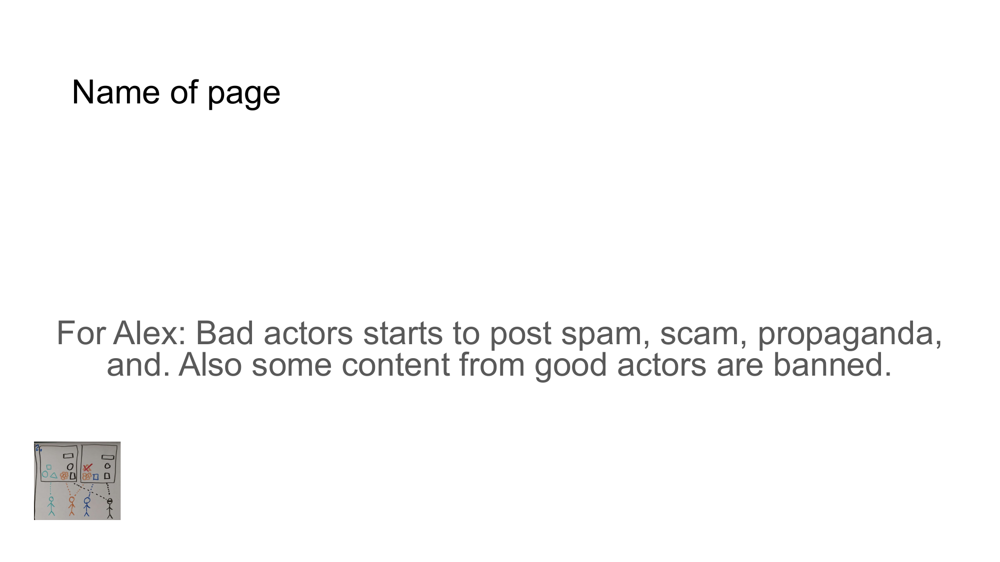

# CONTENT QUALITY CHALLENGES



## For Alex
Bad actors starts to post spam, scam, propaganda, and. Also some content from good actors are banned.

## Content

```
CONTENT QUALITY CHALLENGES

• Bad actors flood systems with spam
• Scams and propaganda spread unchecked
• Legitimate content faces unwarranted bans
• Trust erodes across digital interactions
```

## Notes

Digital platforms struggle with maintaining content quality as bad actors introduce spam, scams, and propaganda, while legitimate content creators sometimes face unjustified restrictions.