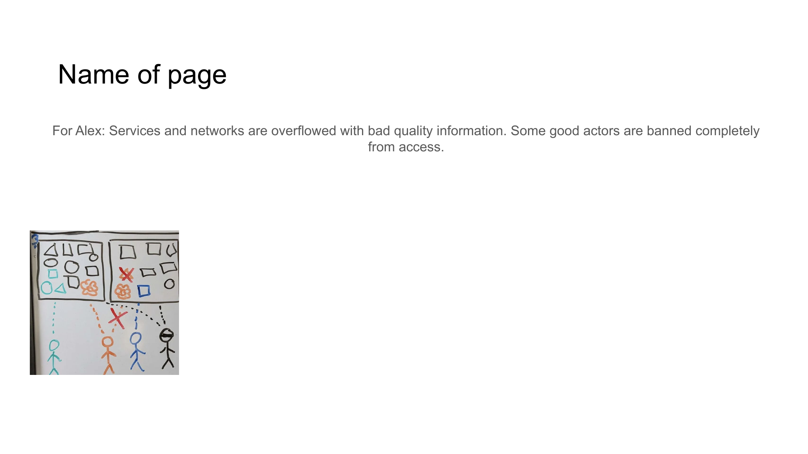

# INFORMATION QUALITY CRISIS



## For Alex
Services and networks are overflowed with bad quality information. Some good actors are banned completely from access.

## Content

```
INFORMATION QUALITY CRISIS

• Services overflow with low-quality information
• Valuable content becomes difficult to find
• Legitimate creators face platform bans
• Access restrictions limit information exchange
```

## Notes

Digital services struggle under the weight of poor-quality information, while valuable contributors sometimes face complete access bans, creating an information ecosystem that underserves users.