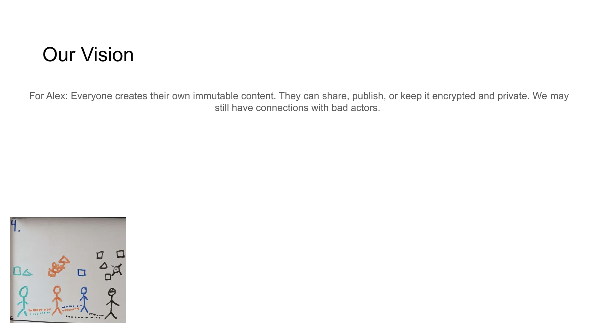

# OUR VISION



## For Alex
Everyone creates their own immutable content. They can share, publish, or keep it encrypted and private. We may still have connections with bad actors.

## Content

```
OUR VISION

• Users create immutable, verifiable content
• Complete control over sharing and publishing
• Private encryption options for sensitive information
• Maintained connections with trust transparency
```

## Notes

We envision a system where everyone creates their own immutable content with full control over sharing, publishing, or keeping information private through encryption, all while maintaining network connections with transparent trust levels.