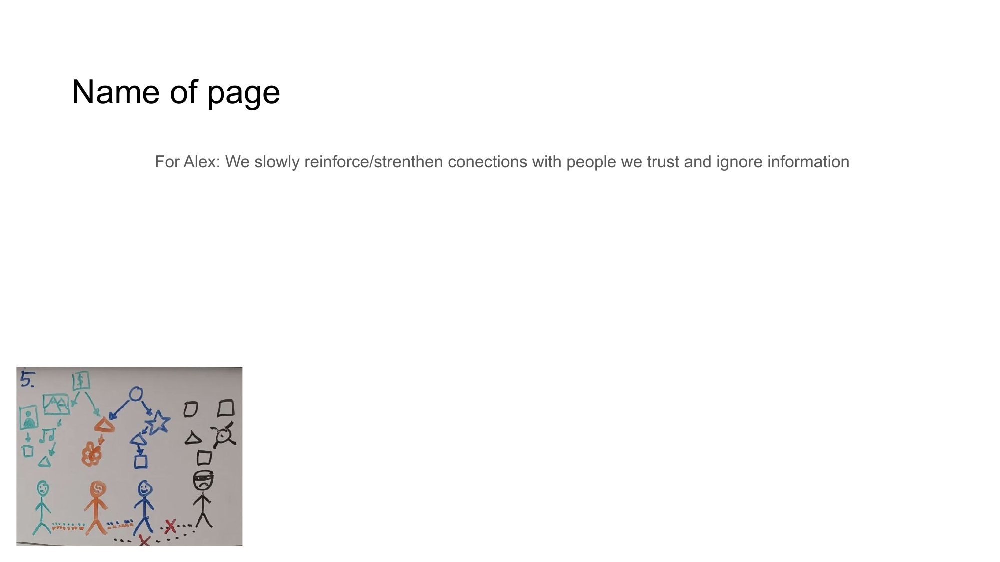

# TRUST NETWORK EVOLUTION



## For Alex
We slowly reinforce/strenthen conections with people we trust and ignore information

## Content

```
TRUST NETWORK EVOLUTION

• Natural strengthening of trusted connections
• Gradual development of personal trust networks
• Reduced visibility for lower-trust information
• User-controlled information filtering systems
```

## Notes

Our approach enables users to naturally reinforce connections with people they trust while reducing exposure to unwanted information, creating self-organizing networks based on personal trust relationships.