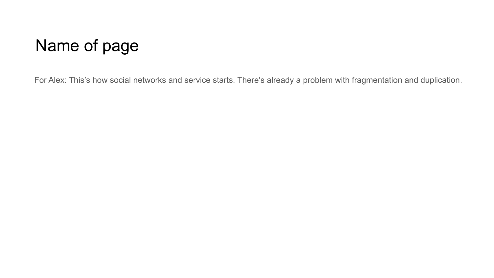

# DECENTRALIZED AI KNOWLEDGE SHARING



## For Alex
Everyone has a part of decentralized AI that can shares knowledge between trusted connections. Blockset can helps to reduce traffic when we and AI share knowledge.

## Content

```
DECENTRALIZED AI KNOWLEDGE SHARING

• Personal AI nodes share knowledge securely
• Knowledge flows through trusted connections
• Blockset reduces network traffic significantly
• Efficient content verification during exchange
```

## Notes

Our technology enables everyone to participate in decentralized AI knowledge sharing through trusted connections, with Blockset technology minimizing bandwidth requirements during information exchange.