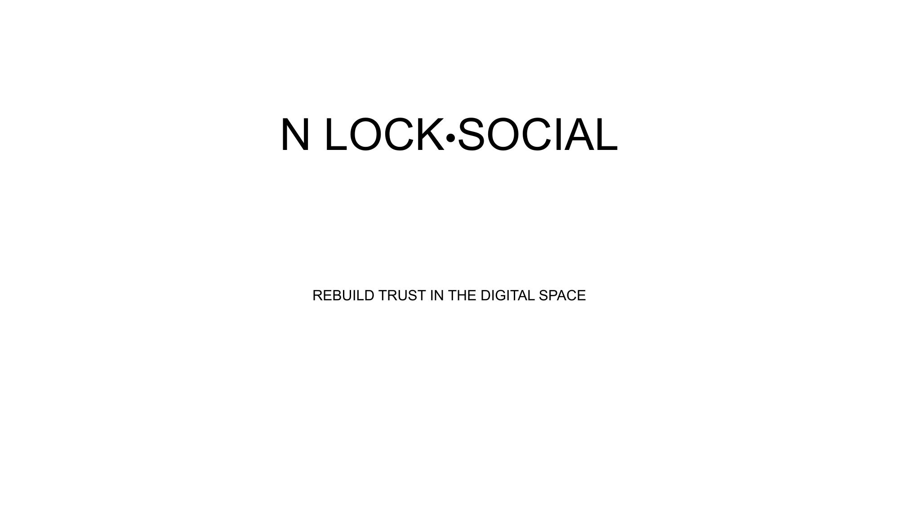

# Slide 1: Title Slide



## Content Type: Introduction / Brand

```
NOLOCK•SOCIAL

REBUILD TRUST IN THE DIGITAL SPACE
```

## Design Elements

- **Background**: Clean white background to create visual impact
- **Logo**: NOLOCK•SOCIAL prominently displayed in bold, modern typography
- **Tagline**: "REBUILD TRUST IN THE DIGITAL SPACE" in slightly smaller font
- **Spacing**: Ample white space to create a professional, uncluttered appearance
- **Typography**: Sans-serif font for modern, tech-forward aesthetic

## Pitch Notes

**Opening statement:**
"Today, we're introducing NoLock Social, a revolutionary approach to rebuilding trust in digital spaces. In a world where online communities are increasingly fractured, content is manipulated, and trust is eroding, we're creating a new foundation for authentic digital connections."

**Key message to convey:**
The name "NoLock" evokes freedom from constraints and vendor lock-in, while emphasizing security and trust. We're not just another social platform—we're rebuilding the very foundation of digital interaction.

## Follow-Up Slide

This opening slide sets the stage for Slide 2, which immediately introduces the problems we're solving in the digital landscape.