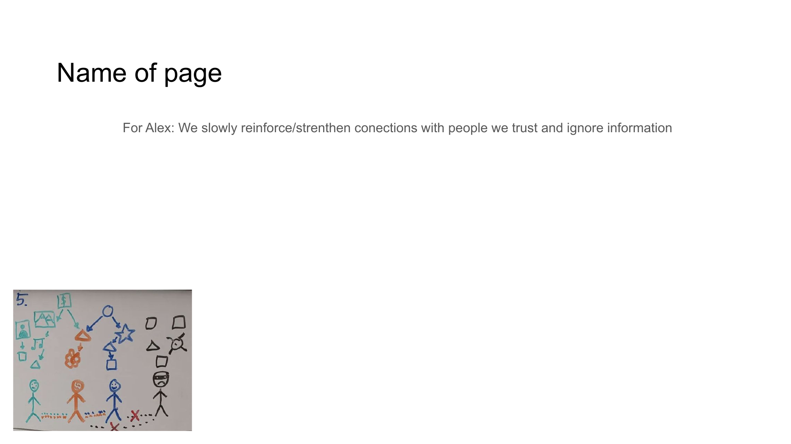

# Slide 6: Trust Networks



## Content Type: Solution / Concept

```
TRUST-BASED FILTERING

• Progressive strengthening of trusted connections
• Natural filtering based on genuine relationships
• User control over information sources
• Quality emerges from network relationships
```

## Design Elements

- **Headline**: Bold, attention-grabbing typography presenting the key concept
- **Bullet Points**: Concise statements highlighting the main aspects
- **Supporting Visual**: Clear visual representation of the concept
- **Layout**: Professional organization with clear hierarchy
- **Color Scheme**: Consistent with overall presentation branding

## Pitch Notes

**Key message:**
"This slide explains how NoLock Social reinforces connections with trusted people while naturally filtering out unwanted information, creating a more authentic digital experience based on real relationships rather than algorithms."

**Supporting points:**
1. "Progressive strengthening of trusted connections"
2. "Natural filtering based on genuine relationships"
3. "User control over information sources"
4. "Quality emerges from network relationships"

**Evidence/Impact:**
"Rather than attempting perfect content moderation through AI—which even the largest platforms have failed to achieve—we enable a more human approach where trust relationships naturally filter information, just as they do in real-world communities."

## Follow-Up Slide

This slide connects to the next slide, continuing the logical flow of the presentation narrative.
