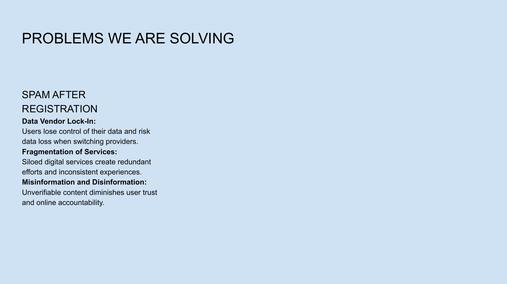

# Slide 16: Benefits



## Content Type: Value Proposition

```
KEY BENEFITS

• True ownership of your digital presence and content
• Consistent experience across devices and contexts
• Reduced noise and increased signal in information flow
• Resilience against platform changes and censorship
```

## Design Elements

- **Headline**: Bold, attention-grabbing typography presenting the key concept
- **Bullet Points**: Concise statements highlighting the main aspects
- **Supporting Visual**: Clear visual representation of the concept
- **Layout**: Professional organization with clear hierarchy
- **Color Scheme**: Consistent with overall presentation branding

## Pitch Notes

**Key message:**
"This slide outlines the key benefits of the NoLock Social approach, focusing on the user-centric advantages it provides over current platforms."

**Supporting points:**
1. "True ownership of your digital presence and content"
2. "Consistent experience across devices and contexts"
3. "Reduced noise and increased signal in information flow"
4. "Resilience against platform changes and censorship"

**Evidence/Impact:**
"These benefits directly address the pain points that billions of users experience daily with current platforms—fragmentation, noise, lack of control, and vulnerability to platform policies."

## Follow-Up Slide

This slide connects to the next slide, continuing the logical flow of the presentation narrative.
