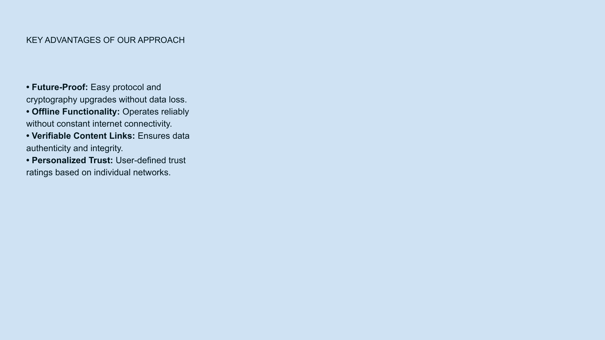

# Slide 18: Key Advantages



## Content Type: Value Proposition / Competitive Differentiation

```
KEY ADVANTAGES OF OUR APPROACH

• Future-Proof: Easy protocol upgrades without data loss

• Offline Functionality: Works without constant connectivity

• Verifiable Content Links: Ensures data authenticity

• Personalized Trust: User-defined network relationships
```

## Design Elements

- **Headline**: "KEY ADVANTAGES OF OUR APPROACH" in clear, impactful typography
- **Advantage Format**: Bold lead-in with supporting explanation for each point
- **Visual Structure**: Four distinct advantages with adequate spacing
- **Background**: Consistent light blue gradient maintaining brand identity
- **Typography**: Clear visual hierarchy with bolded key terms

## Pitch Notes

**Introduction statement:**
"Our approach delivers four fundamental advantages that differentiate NoLock Social from both centralized platforms and other decentralized solutions."

**Key advantages to emphasize:**
1. "Unlike traditional platforms that force disruptive migrations, our future-proof architecture allows easy protocol and cryptography upgrades without any data loss—your content and connections remain intact."
2. "Our offline functionality means you can continue working reliably without constant internet connectivity, accessing your content and even creating new material that syncs when connection is restored."
3. "Every piece of content has verifiable links that ensure data authenticity and integrity, creating a foundation of trust that simply doesn't exist on current platforms."
4. "Instead of black-box algorithms, we enable personalized trust ratings based on your individual network, putting you in control of what information you see and value."

**Competitive differentiation:**
"These advantages address the core limitations of both centralized social platforms and first-generation blockchain solutions, creating a superior experience that's both technically advanced and human-centered."

## Impact Statement

"Together, these advantages create a digital environment that's more resilient, more trustworthy, and more aligned with how humans naturally form relationships and evaluate information."

## Follow-Up Slide

This advantages slide leads naturally to Slide 19, which details our specific technological innovations.