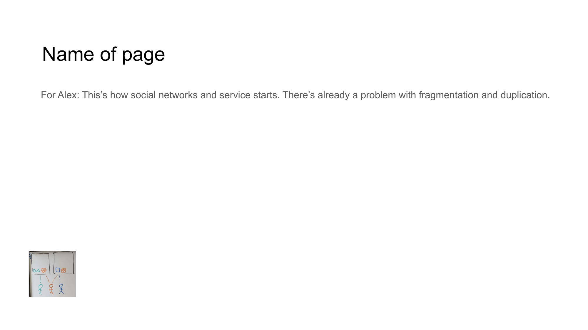

<!-- Navigation Header -->
[⬅️ Previous Slide](slide01.md) | [🏠 Deck Home](../README.md) | [➡️ Next Slide](slide03.md)

[← Previous](slide01.md) | [↑ Overview](../README.md) | [Next →](slide03.md)

---

# The Problem I

## Distrust in Digital Space

*Content authenticity issues and lack of ownership create fundamental digital trust challenges.*

## Critical Issues:

- **Content that can be secretly modified**
  - No guarantee that what you see is what was produced
  - [Source: Reuters Digital News Report](https://reutersinstitute.politics.ox.ac.uk/digital-news-report/2022)

- **No inherent ownership means no responsibility**
  - Rampant misinformation without accountability
  - [Source: World Economic Forum](https://www.weforum.org/agenda/2022/06/digital-trust-in-a-polarized-world/)

> *76% of users struggle to identify authentic content in digital spaces*

---

[← Previous](slide01.md) | [↑ Overview](../README.md) | [Next →](slide03.md)

<!-- Navigation Footer -->
[⬅️ Previous Slide](slide01.md) | [🏠 Deck Home](../README.md) | [➡️ Next Slide](slide03.md)