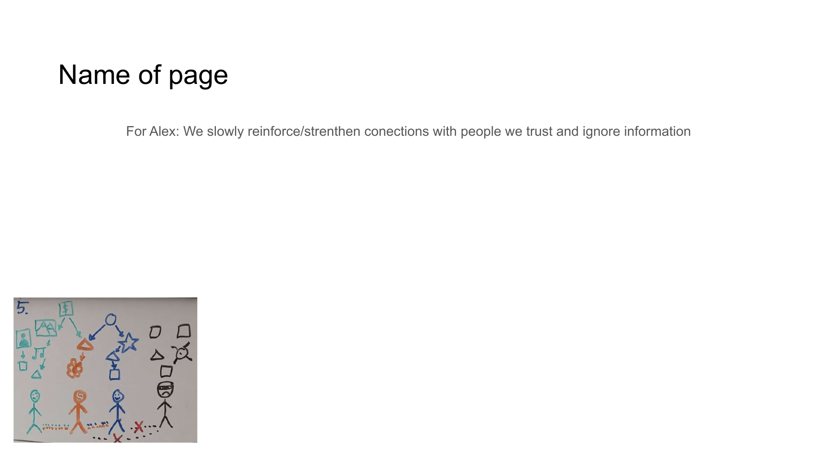

<!-- Navigation Header -->
[⬅️ Previous Slide](slide02.md) | [🏠 Deck Home](../README.md) | [➡️ Next Slide](slide04.md)

[← Previous](slide02.md) | [↑ Overview](../README.md) | [Next →](slide04.md)

---

# Our Solution

## Trust-Based Digital Infrastructure

*Our solution provides user-controlled identity, immutable content verification, and trust-based filtering.*

## NoLock Social Platform:

1. **User-Controlled Digital Identity**
   - Self-sovereign identity verified through trust networks
   
2. **Immutable Content Verification**
   - Cryptographic validation of content authenticity

3. **Trust Network Filtering**
   - Content discovery through weighted social connections

> *"NoLock Social rebuilds digital trust by replacing centralized authorities with transparent, user-controlled networks of trust."*

---

[← Previous](slide02.md) | [↑ Overview](../README.md) | [Next →](slide04.md)

<!-- Navigation Footer -->
[⬅️ Previous Slide](slide02.md) | [🏠 Deck Home](../README.md) | [➡️ Next Slide](slide04.md)