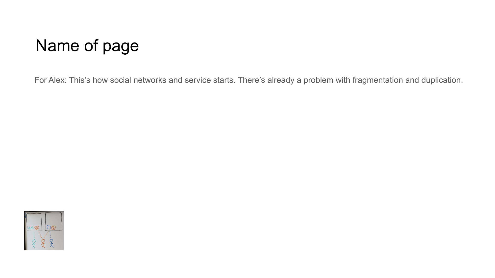

<!-- Navigation Header -->
[⬅️ Previous Slide](slide01.md) | [🏠 Deck Home](../README.md) | [➡️ Next Slide](slide03.md)

# Slide 2: Fragmentation Problem



## Content Type: Problem Statement

```
THE DIGITAL FRAGMENTATION CRISIS

• Users maintain 8+ social profiles across platforms
• Content duplicated and scattered across services
• Digital identity fractured between applications
• No unified experience or content ownership
```

## Design Elements

- **Headline**: Clear problem statement in bold typography
- **Problem Points**: Concise bullet points highlighting key fragmentation issues
- **Supporting Visual**: Diagram showing how social networks and services create fragmentation
- **Visual Impact**: Clear illustration of the disconnect between platforms and user content
- **Color Scheme**: Consistent with brand while emphasizing the problematic state

## Pitch Notes

**Opening problem statement:**
"Today's digital landscape is fundamentally broken. The average person maintains over eight different social profiles, with their content, connections, and identity fractured across these isolated platforms."

**Key problems to emphasize:**
1. "Users are forced to duplicate content across multiple platforms to reach their complete network."
2. "Digital identity is fragmented, with no consistency between services."
3. "Content ownership is surrendered to each platform, creating vendor lock-in."
4. "The user experience is disjointed, requiring constant switching between applications."

**Market validation:**
"This fragmentation isn't just annoying—it's a structural problem affecting billions of users daily, with studies showing that 64% of people find managing their digital presence increasingly overwhelming."

## Statistical Support

"Research shows that platform switching costs users an average of 37 minutes daily in lost productivity, while content duplication leads to inconsistency, errors, and loss of control."

## Follow-Up Slide

This fragmentation problem sets up Slide 3, which addresses the related problem of bad actors and content quality.

<!-- Navigation Footer -->
[⬅️ Previous Slide](slide01.md) | [🏠 Deck Home](../README.md) | [➡️ Next Slide](slide03.md)