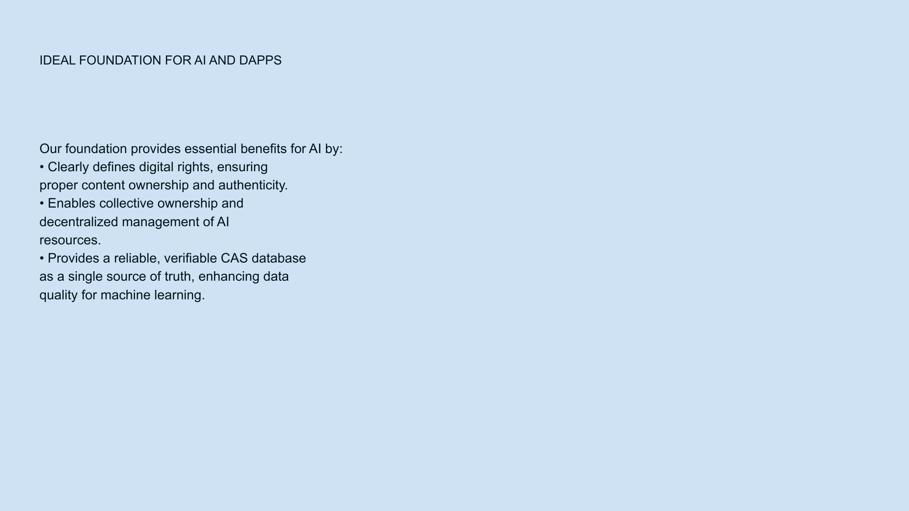

<!-- Navigation Header -->
[⬅️ Previous Slide](slide14.md) | [🏠 Deck Home](../README.md) | [➡️ Next Slide](slide16.md)

# Slide 15: AI Foundation



## Content Type: Value Proposition / Market Opportunity

```
IDEAL FOUNDATION FOR AI AND DAPPS

Our foundation provides essential benefits for AI:

• Digital Rights Framework with verified content ownership
• Collective Ownership of decentralized AI resources
• Verifiable Database as a single source of truth
• Enhanced Data Quality for machine learning
```

## Design Elements

- **Headline**: "IDEAL FOUNDATION FOR AI AND DAPPS" in bold, forward-looking typography
- **Value Proposition Structure**: Clear statement followed by key benefits
- **Background**: Light blue gradient maintaining brand consistency
- **Visual Organization**: Clean bullet points with supporting descriptions
- **Typography**: Professional font hierarchy emphasizing the AI integration benefits

## Pitch Notes

**Opening statement:**
"Beyond solving today's problems, NoLock Social creates an ideal foundation for the next generation of AI and decentralized applications."

**Key benefits to emphasize:**
1. "First, our digital rights framework ensures clear content ownership and authenticity, solving a critical challenge for AI systems that need verified training data."
2. "We enable collective ownership models for AI resources, allowing communities to develop and control AI systems without centralized gatekeepers."
3. "Our verifiable database provides a single source of truth that AI systems can rely on for accurate, trusted information."
4. "Perhaps most importantly, we dramatically enhance data quality for machine learning by providing provenance, context, and verification for all content."

**Market opportunity:**
"As AI becomes increasingly embedded in our digital lives, the need for trusted, verifiable data foundations will only grow—positioning NoLock Social at the intersection of two massive technological trends: decentralization and artificial intelligence."

## Future Vision Statement

"Imagine personal AI assistants that work across all your digital spaces, learning from verified content, respecting privacy boundaries, and creating value without exploiting your data—that's the future NoLock Social enables."

## Follow-Up Slide

This AI integration slide connects to Slide 16, which outlines broader benefits of our technological approach.

<!-- Navigation Footer -->
[⬅️ Previous Slide](slide14.md) | [🏠 Deck Home](../README.md) | [➡️ Next Slide](slide16.md)