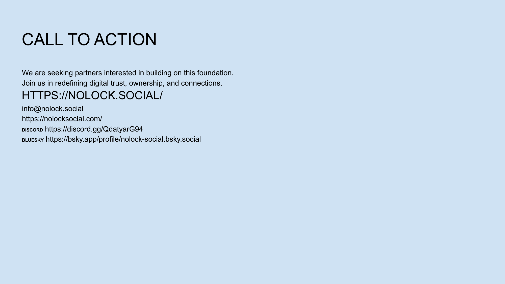

<!-- Navigation Header -->
[⬅️ Previous Slide](slide19.md) | [🏠 Deck Home](../README.md) | [➡️ Next Slide](slide21.md)

# Slide 20: Call to Action



## Content Type: Call to Action / Partnership Opportunities

```
CALL TO ACTION

We are seeking partners interested in building on this foundation.
Join us in redefining digital trust, ownership, and connections.

HTTPS://NOLOCK.SOCIAL/

info@nolock.social
https://nolocksocial.com/

DISCORD  https://discord.gg/QdatyarG94
BLUESKY  https://bsky.app/profile/nolock-social.bsky.social
```

## Design Elements

- **Headline**: "CALL TO ACTION" in large, attention-grabbing typography
- **Partnership Message**: Clear, concise statement about partnership opportunities
- **Contact Information**: Website, email, and social platforms clearly displayed
- **Background**: Light blue background consistent with brand identity
- **Layout**: Balanced design with appropriate visual hierarchy
- **Whitespace**: Clean spacing for professional appearance

## Pitch Notes

**Opening statement:**
"Today marks an opportunity to be part of something transformative. We're not just building another platform—we're creating a new foundation for digital trust."

**Partnership opportunities to emphasize:**
1. "We're seeking strategic partners who share our vision for a more trustworthy digital future."
2. "Technical partners who want to build on our architecture and extend its capabilities."
3. "Content creators and communities looking for more control and authenticity."
4. "Investors who recognize the paradigm shift happening in digital spaces."

**Specific invitations:**
- "Join our developer community to explore our APIs and tools."
- "Connect with us to discuss strategic integration opportunities."
- "Reach out to schedule a technical deep dive or demo."

## Closing Statement

"The future of digital interaction isn't about bigger platforms with more control—it's about empowering individuals with ownership, verifiability, and genuine connection. We invite you to be part of rebuilding trust in the digital space."

## Follow-Up Slide

This call to action leads to the final team slide, which establishes credibility and puts faces to the vision just presented.

<!-- Navigation Footer -->
[⬅️ Previous Slide](slide19.md) | [🏠 Deck Home](../README.md) | [➡️ Next Slide](slide21.md)