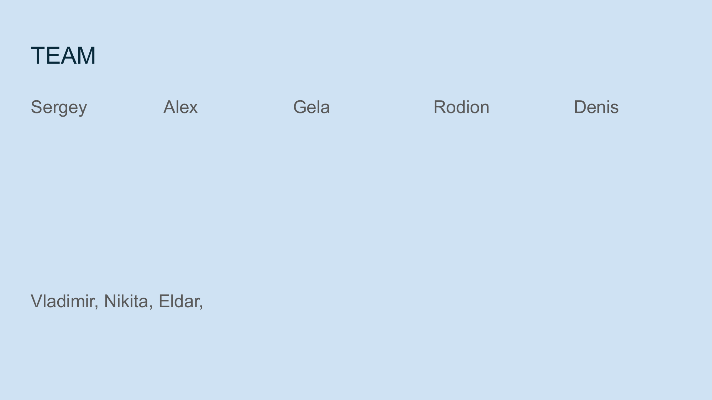

<!-- Navigation Header -->
[⬅️ Previous Slide](slide20.md) | [🏠 Deck Home](../README.md) | [➡️ Next Slide](slide01.md)

# Slide 21: Team



## Content Type: Credibility / Team Introduction

```
TEAM

Sergey     Alex     Gela     Rodion     Denis

Vladimir, Nikita, Eldar
```

## Design Elements

- **Headline**: "TEAM" in bold, professional typography
- **Team Layout**: Names arranged with ample spacing for clarity
- **Background**: Consistent light blue background maintaining visual continuity
- **Typography**: Clean, professional font for team members' names
- **Visual Hierarchy**: Primary team members given prominence, with supporting team below

## Pitch Notes

**Introduction approach:**
"Behind NoLock Social is a world-class team combining expertise in distributed systems, cryptography, user experience, and social network development."

**Team highlights:**
- "Sergey brings extensive experience in content-addressable systems and is the creator of Blockset and FunctionalScript."
- "Alex leads our product strategy and user experience design, ensuring our technical innovations translate to intuitive human experiences."
- "Gela architects our overall system design with deep expertise in distributed system architecture."
- "Rodion oversees network security and protocol development, with a background in cryptographic systems."
- "Denis specializes in distributed systems and data integrity verification."
- "Our development team includes Vladimir, Nikita, and Eldar, who bring diverse expertise in full-stack development."

**Team advantage statement:**
"Together, our team combines over 50 years of experience in creating decentralized technologies, user-centered design, and secure communication systems—the perfect blend of skills to tackle the challenge of rebuilding digital trust."

## Closing Remarks

"We're not just technologists—we're individuals who deeply believe in the need for a more authentic, user-controlled digital landscape. We're committed to making this vision a reality, and we invite you to join us on this journey."

## Q&A Transition

This final slide provides a natural transition to Q&A or more in-depth discussions about specific aspects of NoLock Social that resonate with the audience.

<!-- Navigation Footer -->
[⬅️ Previous Slide](slide20.md) | [🏠 Deck Home](../README.md) | [➡️ Next Slide](slide01.md)