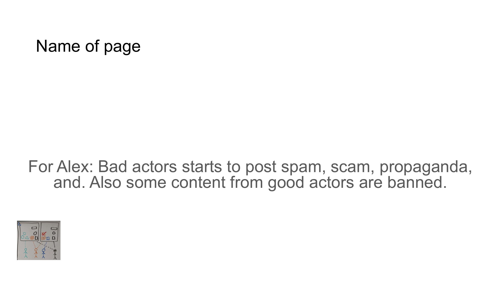

# Slide 3: Bad Actors



## Content

```
For Alex: Bad actors starts to post spam, scam, propaganda, 
and. Also some content from good actors are banned. 
Name of page
```

## Description

This slide discusses how bad actors post spam, scams, and propaganda, while some legitimate content from good actors gets banned.

## Key Points

- Bad actors spread spam, scams, and propaganda across platforms
- Content moderation struggles to identify harmful content
- Some legitimate content is incorrectly flagged and removed
- Trust in platform moderation diminishes

[Back to Index](../README.md) | [Previous Slide](slide02.md) | [Next Slide](slide04.md)