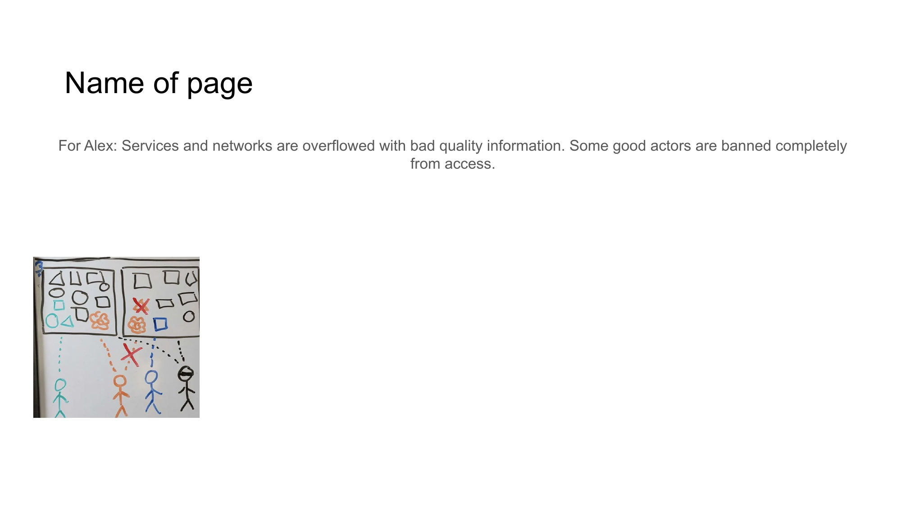

# Slide 4: Information Overload



## Content

```
Name of page 
For Alex: Services and networks are overflowed with bad quality information. Some good actors are banned completely 
from access.
```

## Description

This slide explains how services become overflowed with low-quality information, and how some users are completely banned from access.

## Key Points

- Digital services are overwhelmed with low-quality information
- Signal-to-noise ratio continuously decreases
- Some legitimate users lose access entirely
- Information quality becomes harder to verify

[Back to Index](../README.md) | [Previous Slide](slide03.md) | [Next Slide](slide05.md)