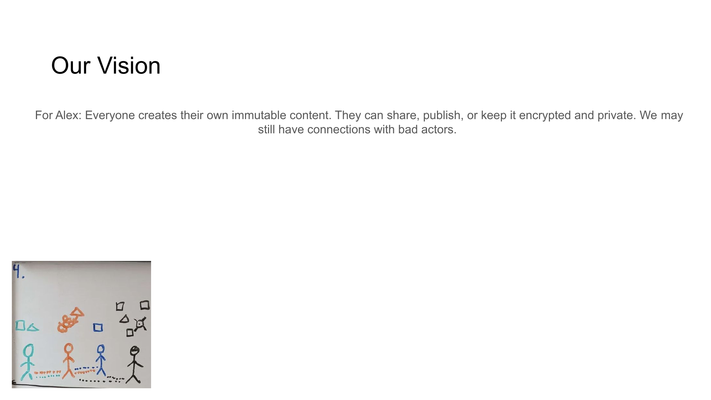

# Slide 5: Our Vision



## Content

```
Our Vision

Everyone creates their own immutable content. They can share, publish, or keep it encrypted and private. We may still have connections with bad actors.
```

## Description

This slide outlines the core vision of NoLock Social, focusing on user ownership and control of content. The vision emphasizes that users should create immutable content that they control entirely, with options to share publicly, publish selectively, or keep encrypted and private.

## Key Points

- Content is immutable and owned by its creator
- Users have complete control over visibility (public, private, or encrypted)
- The system acknowledges that connections with problematic actors may still exist
- Trust is built through direct user connections, not algorithmic recommendations

## Expanded Vision

NoLock Social envisions a digital ecosystem where the focus shifts from platform control to user autonomy. In this vision, each piece of content has verified provenance, cannot be altered after creation, and remains under the full control of its creator.

[Back to Index](../README.md) | [Previous Slide](slide04.md) | [Next Slide](slide06.md)