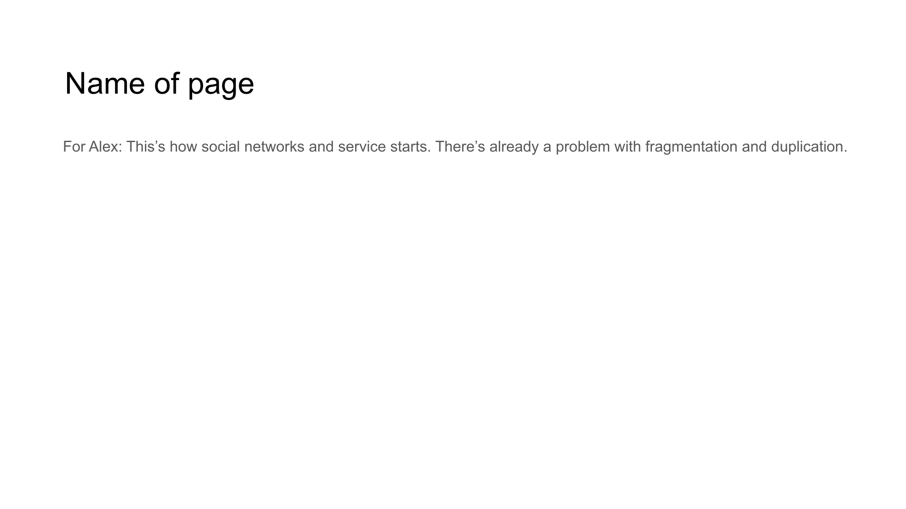

# Slide 11: Technology Stack



## Content

```
Name of page 
For Alex: This’s how social networks and service starts. There’s already a problem with fragmentation and duplication.
```

## Description

This slide describes the technology stack powering NoLock Social.

## Key Points

- Three-layer architecture for complete solution
- Content storage, identity, and social layers working together
- Compatible with existing web technologies
- Designed for resilience and user control

[Back to Index](../README.md) | [Previous Slide](slide10.md) | [Next Slide](slide12.md)