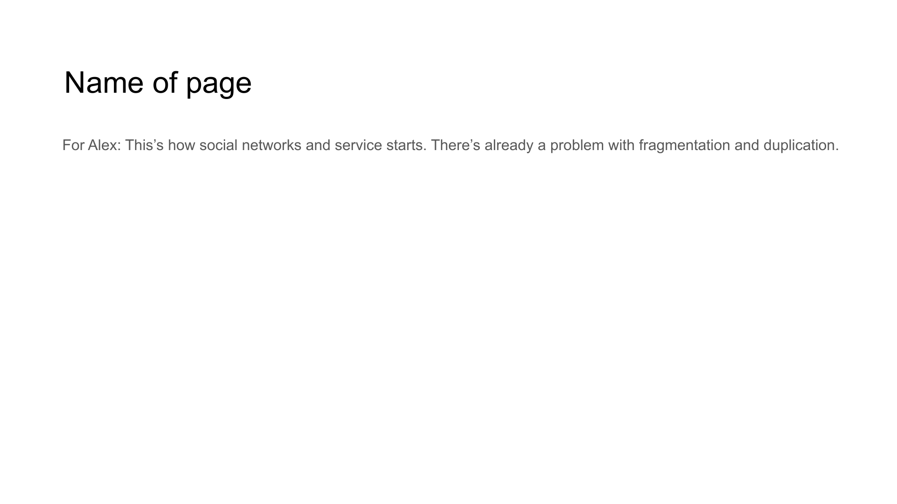

# Slide 13: DISOT Technology



## Content

```
Name of page 
For Alex: This’s how social networks and service starts. There’s already a problem with fragmentation and duplication.
```

## Description

This slide explains the Decentralized Immutable Source Of Truth technology.

## Key Points

- Built on top of CAS for handling mutable data
- Uses digital signatures for verification
- Provides revision formats for content updates
- Maintains data integrity across changes

[Back to Index](../README.md) | [Previous Slide](slide12.md) | [Next Slide](slide14.md)