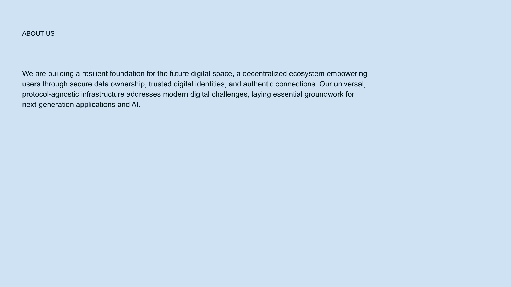

# Slide 14: Trust Networks



## Content

```
ABOUT US 
We are building a resilient foundation for the future digital space, a decentralized ecosystem empowering 
users through secure data ownership, trusted digital identities, and authentic connections. Our universal, 
protocol-agnostic infrastructure addresses modern digital challenges, laying essential groundwork for 
next-generation applications and AI.
```

## Description

This slide details how Networks of Trust are built and function in the NoLock ecosystem.

## Key Points

- Built on DISOT for verifiable connections
- Focuses on weighted subjective trust
- Reduces information noise through trust filtering
- Creates positive-sum interactions between users

[Back to Index](../README.md) | [Previous Slide](slide13.md) | [Next Slide](slide15.md)