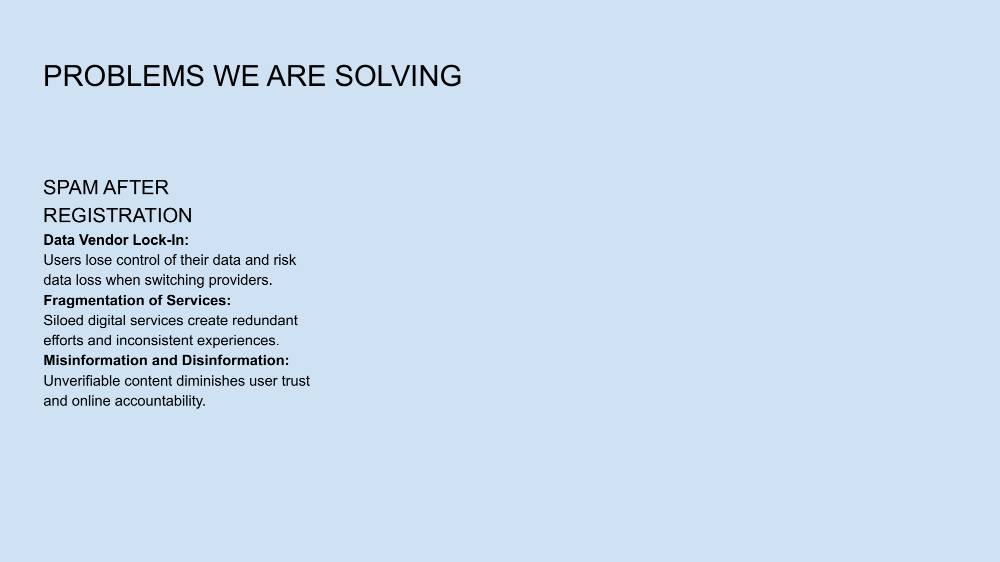

# Slide 16: Technology Benefits



## Content

```
PROBLEMS WE ARE SOLVING 
SPAM AFTER 
REGISTRATION 
Data Vendor Lock-In: 
Users lose control of their data and risk 
data loss when switching providers. 
Fragmentation of Services: 
Siloed digital services create redundant 
efforts and inconsistent experiences. 
Misinformation and Disinformation: 
Unverifiable content diminishes user trust 
and online accountability.
```

## Description

This slide outlines the key benefits of NoLock's technology approach.

## Key Points

- Improved data ownership and control
- Enhanced privacy through encryption options
- Better content discovery through trust networks
- Resilience against censorship and platform changes

[Back to Index](../README.md) | [Previous Slide](slide15.md) | [Next Slide](slide17.md)