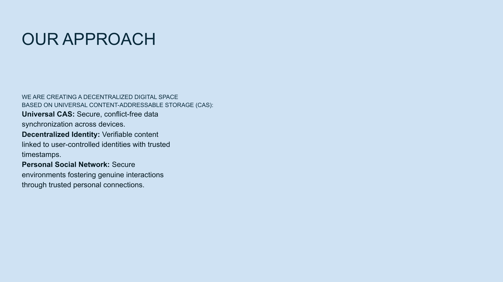

# Slide 17: Our Approach



## Content

```
OUR APPROACH

WE ARE CREATING A DECENTRALIZED DIGITAL SPACE
BASED ON UNIVERSAL CONTENT-ADDRESSABLE STORAGE (CAS):

Universal CAS: Secure, conflict-free data synchronization across devices.

Decentralized Identity: Verifiable content linked to user-controlled identities with trusted timestamps.

Personal Social Network: Secure environments fostering genuine interactions through trusted personal connections.
```

## Description

This slide outlines the three-pillar approach that NoLock Social is using to create a decentralized digital space. It explains the technical foundation of the platform based on Universal Content-Addressable Storage (CAS).

## Key Components

1. **Universal Content-Addressable Storage (CAS)**
   - Provides secure, conflict-free data synchronization across all user devices
   - Content is identified by what it is, not where it's stored
   - Enables efficient storage and retrieval without central control

2. **Decentralized Identity**
   - Links verifiable content to user-controlled identities
   - Incorporates trusted timestamps for content verification
   - Gives users control over their digital presence

3. **Personal Social Network**
   - Creates secure environments for genuine interactions
   - Builds on trusted personal connections
   - Filters content based on trusted relationships, not algorithms

## Technical Significance

This approach represents a fundamental shift from location-based storage and platform-controlled identity to a content-centric, user-controlled digital ecosystem. By addressing the foundational layers of storage, identity, and social connection, NoLock Social creates a comprehensive solution to the problems of digital trust.

[Back to Index](../README.md) | [Previous Slide](slide16.md) | [Next Slide](slide18.md)